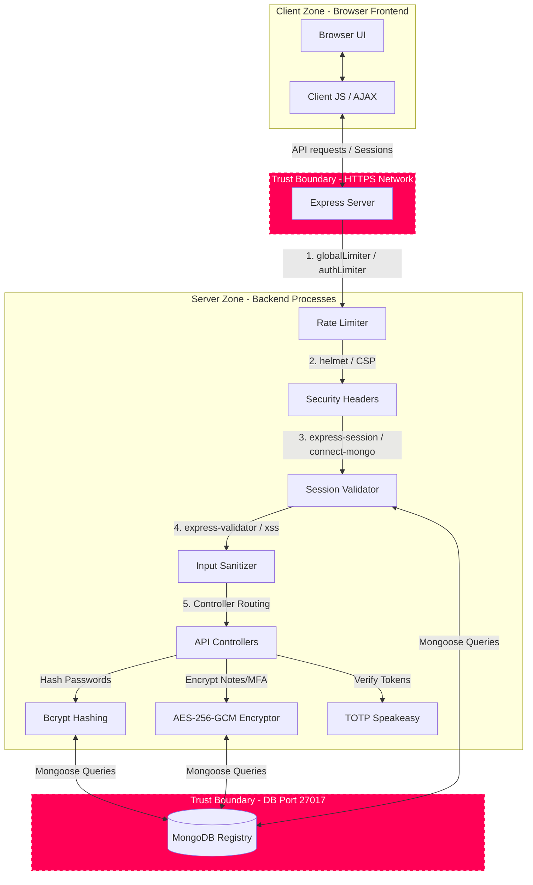

# STRIDE Threat Modeling Report

**Project Name:** CyberShield Secure Web Application  
**Module:** Secure Software Development  
**Academic Target:** 15 Marks (Week 14)  
**Status:** Approved & Implemented  

---

## 1. System Overview & Architecture

CyberShield is a secure web application utilizing a modern 3-tier architecture: **Vanilla JS/CSS Frontend**, **Node.js/Express Server Backend**, and a persistent **MongoDB Database**. It implements advanced session managers, Role-Based Access Controls (RBAC), multi-factor token authentication (MFA/TOTP), and data encryption at rest.

### 1.1 Data Flow Diagram (DFD)

The following diagram maps the data flows, process boundaries, trust boundaries, and data stores within the application:

---

## 2. STRIDE Threat Analysis

We apply the **STRIDE** methodology to systematically evaluate security risks across the application's components and boundaries:

| Threat Category | Threat Description | Affected Component | Implemented Mitigation |
| :--- | :--- | :--- | :--- |
| **S**poofing | An attacker guesses or brute-forces another user's credentials to masquerade as them. | Authentication & Route controllers | 1. Hashed password storage using **Bcrypt (12 rounds)**. 2. **Multi-Factor Authentication (MFA/TOTP)** via Google Authenticator. 3. Strict request rate limiting (**5 attempts/min on auth**). 4. Offline-friendly, server-generated **Mathematical CAPTCHA**. |
| **T**ampering | An attacker intercepts and alters session cookies, input parameters, or sensitive user notes. | Cookie Session & Inputs | 1. **SameSite=Strict** and **HttpOnly** cookies to prevent external domain manipulation and CSRF. 2. Parameter validation using **express-validator**. 3. Cross-Site Scripting (XSS) input filtering using **xss** sanitizer. 4. Encryption at rest for user notes using **AES-256-GCM** to prevent direct database tampering. |
| **R**epudiation | A user denies performing an action (e.g. promoting a role or deleting an account) due to lack of logging. | Audit Log subsystem | 1. Persistent, structured **SecurityLog** Mongoose model in MongoDB. 2. Systematic logging of critical operations (`LOGIN_FAILURE`, `MFA_SETUP`, `ROLE_CHANGE`, `USER_DELETED`, `RATE_LIMIT_EXCEEDED`). 3. Automatically captured IP addresses and User-Agent headers. |
| **I**nformation Disclosure | An attacker steals session IDs via XSS or reads sensitive personal data directly from the database files. | Data store & Cookie Session | 1. **HttpOnly** cookies block client-side script access to session tokens, mitigating XSS theft. 2. AES-256-GCM encryption of sensitive note variables and MFA secrets at rest. 3. Strict Content Security Policy (CSP) headers block unauthorized external script injection. |
| **D**enial of Service | An attacker floods the auth routes with high-volume requests to crash the application database. | Express Server Routing | 1. Global rate-limiting middleware (**100 requests per 15 minutes** per IP). 2. Hard-coded payload limiters (`10kb` limit on JSON/URLEncoded inputs) to prevent memory exhaustion attacks. 3. Indexing on username queries in MongoDB to optimize search speed. |
| **E**levation of Privilege | A standard user gains access to admin dashboards by manually navigating to `/admin-dashboard.html` or injecting roles. | Authorization (RBAC) | 1. Strict **Role-Based Access Control (RBAC)** checking session roles (`req.session.user.role`). 2. Restricting client static dashboards by routing dashboard HTML pages through authorization middleware. 3. Server-side validation strictly blocking standard users from promoting roles. |

---

## 3. Specific Threat Modeling Scenarios

### Scenario A: Session Hijacking via Man-in-the-Middle (MITM)
*   **STRIDE Category:** Spoofing / Tampering / Information Disclosure.
*   **Threat Vector:** An attacker captures the `SECURE_SESS_ID` cookie value from a user's network traffic and uses it on another device to hijack their active session.
*   **Applied Mitigation:** 
    1. During login, a cryptographic fingerprint hash is generated: `sha256(User-Agent + Client-IP)`.
    2. This fingerprint is bound directly into the server's session record (`req.session.fingerprint`).
    3. On every incoming request, the `preventSessionHijacking` middleware regenerates the current request fingerprint and compares it to the session fingerprint.
    4. If a mismatch is detected, the server immediately destroys the session, records a `UNAUTHORIZED_ACCESS` log entry, clears cookies, and forces re-authentication.

### Scenario B: Database Breach / Direct Access
*   **STRIDE Category:** Information Disclosure.
*   **Threat Vector:** An attacker gains unauthorized direct read access to MongoDB database backups or raw database logs, stealing users' MFA secrets and private notes.
*   **Applied Mitigation:**
    1. **AES-256-GCM symmetric encryption** is applied to both the user's `personalNote` and `twoFactorSecret` fields before storage.
    2. A cryptographically secure 12-byte initialization vector (IV) is dynamically generated for each encryption event.
    3. The ciphertext, IV, and the 16-byte authenticity tag (which guarantees data integrity) are combined and stored in the database.
    4. Even if the database files are fully compromised, the attacker cannot read notes or MFA base32 secrets without the symmetric key stored securely in the server's `.env` environment variables.

### Scenario C: Password Guessing / Brute Force
*   **STRIDE Category:** Spoofing / Denial of Service.
*   **Threat Vector:** An attacker runs automated dictionaries against `/api/login` trying to guess user passwords.
*   **Applied Mitigation:**
    1. **Bcrypt with 12 salt rounds** ensures password comparison is CPU-intensive, slowing offline dictionary cracking to a crawl.
    2. **Rate Limiting** restricts IPs to 5 attempts per minute, locking brute-force script velocities.
    3. **Mathematical CAPTCHA** requires the client to evaluate a new, randomized algebraic formula (`X + Y = ?`) server-side for each submission, preventing automated login submissions completely.
