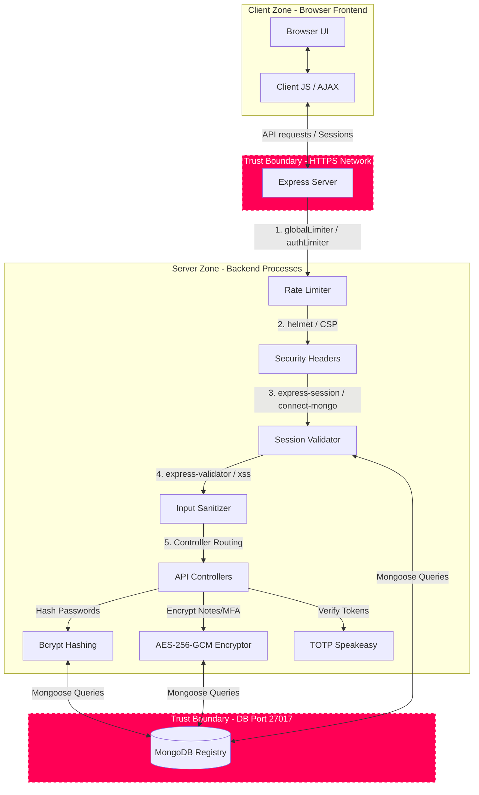

# STRIDE Threat Modeling Report

## Application Name: CyberShield Secure Web Application
## Team Members: Suad Sayed

---

## Threat Identification

| Threat Category | Description | Potential Impact | Mitigation Strategies |
|-----------------|-------------|------------------|-----------------------|
| **Spoofing** | Attacker intercepts/replays active session identifiers or brute-forces user credentials to masquerade as another user. | Unidentified accounts hijacking, unauthorized personal note reading, and system compromise. | 1. Hash passwords using **Bcrypt (12 rounds)**. 2. Dynamic server-side **Math CAPTCHA SVGs** block bot scripts. 3. Optional second-factor **TOTP Multi-Factor Authentication (MFA)**. |
| **Tampering** | Attacker modifies session cookie parameters to hijack authentication flows, or tampers with note parameters sent to APIs. | Compromising account security, parameter manipulation, and unauthorized database overrides. | 1. Enable **HttpOnly**, **SameSite=Strict** cookie attributes to prevent CSRF. 2. Validation using **express-validator**. 3. Input sanitization using **xss** to block XSS payloads. |
| **Repudiation** | System events occur without logging, letting users perform sensitive admin/user changes and later deny doing so. | Lack of security event attribution, inability to perform forensic audits, and trace compromises. | 1. Persistent Mongoose **SecurityLogModel** in MongoDB. 2. Automated recording of critical events (`LOGIN_FAILURE`, `MFA_SETUP`, `ROLE_CHANGE`, `USER_DELETED`, `RATE_LIMIT_EXCEEDED`). |
| **Information Disclosure** | Leakage of session IDs via browser XSS scripts, or direct access to user notes and MFA secrets in database backups. | Theft of active sessions, exposure of sensitive personal notes (SSNs, secrets) at rest, and leaked MFA secret base32 keys. | 1. **AES-256-GCM symmetric encryption at rest** for user notes and MFA secrets. 2. Helmet Content Security Policy (CSP) headers block browser data leaks. 3. Cookies hidden from DOM JS scripts via `HttpOnly`. |
| **Denial of Service** | Attacker floods login or signup routes with thousands of simultaneous TCP connections, overloading Mongo DB threads. | Complete application downtime, server crashes, and database memory exhaustion. | 1. Global API request throttling using **express-rate-limit** (100 reqs/15 mins). 2. Strict login/signup throttling (5 reqs/min). 3. JSON body parser maximum limits locked at a safe `10kb` threshold. |
| **Elevation of Privilege** | Regular user attempts to access administrative pages or directly promote their account role. | Access to restricted admin panels, unauthorized user deletions, role demotions, and system takeover. | 1. Server-side **Role-Based Access Control (RBAC)** middleware validation. 2. Serving dashboards (`/admin-dashboard.html`) strictly via Express authentication controllers. 3. Block role modification inputs from signup forms. |

---

## STRIDE Categories:

| Threat Type | Description | Example in Your App | Mitigation |
|-------------|-------------|---------------------|------------|
| **S**poofing | Impersonating another user | Login without verification / Brute force password guessing | Use hashed passwords via Bcrypt, TOTP Multi-Factor Authentication, math CAPTCHAs, and session fingerprinting |
| **T**ampering | Modifying data in transit or storage | Changing data in DB via API / CSRF parameter tweaks | Use HTTP-only/SameSite=Strict cookies, express-validator schemas, and `xss` sanitizing filters |
| **R**epudiation | Denying actions performed | No logs for user actions | Enable logging via custom Mongoose SecurityLogModel audit trails |
| **I**nformation Disclosure | Leaking sensitive data | Exposing email/password in error / Reading DB notes at rest | Use generic errors, hide detailed server stacks, and apply AES-256-GCM symmetric block ciphers at rest |
| **D** Denial of Service | Making app unavailable | Spamming login or signup | Add global rate limiting (100 reqs/15 mins), auth rate limits (5 reqs/min), and 10kb body payload limits |
| **E** Elevation of Privilege | Gaining unauthorized access | User accessing admin panel | Implement role-based checks (RBAC) on Express controllers and restrict HTML page direct serving |

---

## STRIDE Diagram

---

## Notes
- All STRIDE threats have corresponding DREAD scores in the next section.
